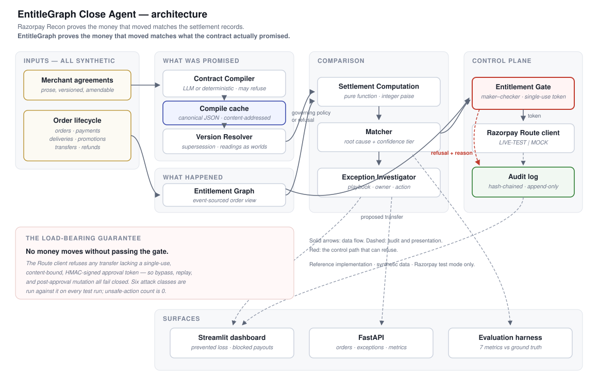

# EntitleGraph Close Agent

**Razorpay Buildathon 2026 · Track 4 (AI Finance Controller)**

> **Razorpay Recon proves the money that moved matches the settlement records.
> EntitleGraph proves the money that moved matches what the contract actually
> promised.**

A payment record proves money was collected. It cannot prove a seller was
*entitled* to receive their share at the moment a transfer went out — paid before
delivery was confirmed, paid under a commission rate that had been superseded, or
refunded to the customer without the seller's payout being clawed back first.

Reconciliation asks *"does the ledger agree with itself?"* EntitleGraph asks
*"was this party contractually entitled to what they received?"* — a semantic
question about the agreement, which no amount of ledger-matching can answer. It
compiles prose merchant agreements into typed, versioned policy, computes each
party's entitlement per order, and **refuses to let a transfer fire** when the
two disagree.

On the synthetic batch it caught **₹19,941.19** of incorrect payouts before they
executed, and correctly declined to decide on 7 of 40 orders where the contract
genuinely does not say.

---

## Quickstart

```bash
pip install -r requirements.txt
python -m tests.eval          # scored evaluation report
```

No API keys needed — everything runs offline in `MOCK` mode and says so loudly.

```bash
streamlit run dashboard/app.py     # dashboard (start here for the demo)
uvicorn src.api.app:app --reload   # API docs at localhost:8000/docs
python -m pytest -q                # 163 tests, ~5s
python -m data.generator           # regenerate synthetic data
```

To exercise real Razorpay **test-mode** calls, copy `.env.example` to `.env` and
add a `rzp_test_...` key. The mode indicator switches to `LIVE-TEST` in logs, API
responses, and the dashboard banner. Live keys (`rzp_live_...`) are refused at
construction with no override.

---

## Results

| Metric | Result |
|---|---|
| **Prevented loss** | **₹19,941.19** |
| Classification accuracy | 100% (40/40 orders) |
| Exception precision / recall | 100% / 100% |
| Amount-weighted accuracy | 100% |
| Exact entitlement-match rate | 70.6% (24/34 resolvable) |
| Auto-close rate | 50% (20/40) |
| Throughput | ~520 records/sec |
| **Unsafe-action count** | **0** — verified by 6 attack classes, not by observation |

20 of 40 orders carry injected defects across 8 categories. The exact-match rate
is deliberately not near 100%: if it were, the test data would contain nothing to
find.

---

## Architecture



The system holds two representations of each order and compares them: **what was
promised** (compiled contract) and **what happened** (the ledger). Everything
else is machinery for producing those faithfully and reporting disagreements.

Three ideas carry the design:

**1. "I don't know" is a representable state.** Any field in the Policy DSL may
be `null` with an attached ambiguity carrying the competing readings and the
clause text. An extractor forced to always produce a number will produce one —
and an invented commission rate does not fail loudly, it settles money and
reports success.

**2. Ambiguity is scoped per order, not per contract.** Each defensible reading
of an ambiguous effective date is used to resolve the entire version stack, then
the elected versions are compared. If every reading elects the same version, the
ambiguity does not matter for that order. That is what keeps the conflict window
finite: 3 orders held, 37 unaffected, from a document that is equally ambiguous
throughout.

**3. Nothing moves money except through the gate.** The Razorpay client refuses
any transfer without a single-use, content-bound, HMAC-signed approval token that
only the gate can issue. Bypass, replay, and post-approval mutation all fail
closed.

---

## What broke

The buildathon asks what went wrong. The full account is in
[`docs/CHANGELOG.md`](docs/CHANGELOG.md); the short version:

A seller's commission changed from 70% to 65% mid-month, in an amendment stating
it was effective "from the commencement of the current billing month" but
executed on the 12th. Both dates are defensible.

The first resolver silently picked one — because contract versions carry no end
date, version 1's window was effectively infinite, so every February order
settled at the superseded rate and the engine reported no problem at all. The bug
was invisible precisely because the output looked clean.

The fix over-corrected: with a naive conflict check, orders in March and June
were flagged too, because version 1 still never ended. An exception queue that
flags everything forever is the same as no exception queue.

The real fix was two ideas — versions *supersede* rather than overlap, and each
reading is evaluated as a complete world. The conflict window is now exactly
1–11 February. Orders `ORD-1011`, `ORD-1012`, `ORD-1013` are held with ₹8,120.98
in seller payouts frozen and both competing rates shown to the reviewer.

That behaviour is the product. Detecting that an ambiguity exists *before* money
moves, and knowing exactly which orders it touches, is worth more than resolving
it automatically and being wrong half the time.

---

## Repository

| Path | Contents |
|---|---|
| `src/contract_compiler/` | Policy DSL, LLM + deterministic backends, compile cache, version resolver |
| `src/settlement_engine/` | Entitlement computation, matcher, maker-checker gate |
| `src/exception_investigator/` | Root-cause playbooks, triage, optional narratives |
| `src/razorpay_client/` | Route wrapper, LIVE-TEST/MOCK, token enforcement |
| `src/audit/` | Hash-chained append-only log |
| `data/generator/` | Synthetic contracts and ledger, ground truth |
| `dashboard/`, `src/api/` | Streamlit UI, FastAPI |
| `tests/` | 163 tests: unit, integration, adversarial, evaluation |

### Documentation

- [`docs/prd.md`](docs/prd.md) — problem, audience, scope boundaries
- [`docs/TRD.md`](docs/TRD.md) — requirements, mocked-vs-real inventory, determinism
- [`docs/architecture.md`](docs/architecture.md) — components, data flow, scaling, security
- [`docs/database.md`](docs/database.md) — schemas and the event model
- [`docs/test_plan.md`](docs/test_plan.md) — coverage **and known limitations**
- [`docs/CHANGELOG.md`](docs/CHANGELOG.md) — the failure narrative and every design decision
- [`DEMO.md`](DEMO.md) — 5-minute pitch script
- [`BUILD_PROMPT.md`](BUILD_PROMPT.md) — the build specification this was written against

---

## Constraints

- **All data is synthetic**, generated by this repository. No real merchant data.
- **Test mode only.** Live Razorpay keys are refused; analysis runs never move
  money at all.
- **Reference implementation.** No production integration, no auth surface.
- **Reproducible offline.** Compiled contracts are cached as canonical JSON, so
  the scored pipeline produces identical numbers with every API key removed —
  asserted in `tests/eval/test_reproducibility.py`.
