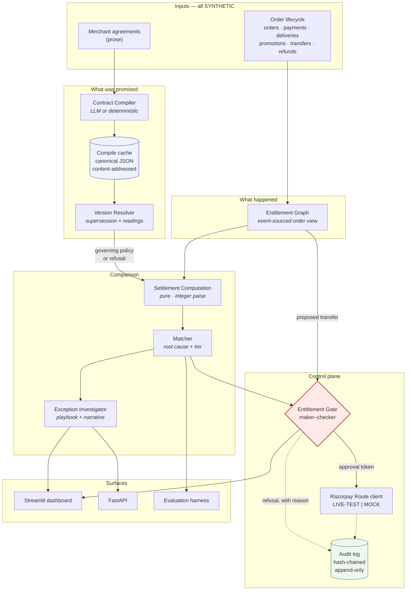

# Architecture — EntitleGraph Close Agent

> **Razorpay Recon proves the money that moved matches the settlement records.
> EntitleGraph proves the money that moved matches what the contract actually
> promised.**

Recon reconciles the ledger against itself and against the bank. EntitleGraph
reconciles the ledger against *the agreement*. This document describes how.

---

## 1. The shape of the system

The system holds two representations of the same order and compares them:

- **What was promised** — the compiled contract (`Policy`), derived from prose.
- **What happened** — the ledger (orders, deliveries, transfers, refunds).

Everything else is machinery for producing those two views faithfully and
reporting where they disagree.



An exported image is at [`diagrams/architecture.svg`](../diagrams/architecture.svg);
the Mermaid source is [`diagrams/architecture.mmd`](../diagrams/architecture.mmd).

---

## 2. Components

### 2.1 Contract Compiler — `src/contract_compiler/`

Turns prose into a typed `Policy`. This is the module the project's claim rests
on; if it is shallow, nothing downstream means anything.

The DSL's defining property is that **any field may refuse to have a value**. A
field can be `null` with an attached `Ambiguity` carrying the competing readings
and the clause text. An extractor forced to always produce a number will produce
one, and an invented commission rate settles money while reporting success.

Two backends: `llm` (Anthropic, prompted to refuse rather than guess) and
`deterministic` (rule-based over the synthetic corpus, for hermetic runs). Both
emit the same DSL shape, including ambiguities.

**Compile cache.** Keyed by content hash of the agreement text. A hit never
invokes a backend. The scored pipeline reads only cached artifacts, which is what
makes the metrics reproducible with no key and no network.

### 2.2 Version Resolver — `resolver.py`

Answers "which version governed this order?" — and sometimes "I cannot tell".

Two ideas make it correct:

- **Supersession.** Versions do not overlap; a later version supersedes its
  predecessor. The predecessor's end date is implied by the successor's start,
  because real amendments rarely state one.
- **Readings as complete worlds.** Each defensible effective date is used to
  resolve the *entire* version stack, then the elected versions are compared. If
  every reading elects the same version, the ambiguity does not matter for this
  order. Only where readings disagree is the order conflicted.

This is what keeps the conflict window finite: three orders held, thirty-seven
unaffected, from a document that is equally ambiguous throughout.

### 2.2a Entitlement Graph — `src/entitlement_graph/graph.py`

The ledger arrives as flat lists — every order, every delivery, every transfer in
separate collections. This module owns the join, folding them into a per-order
view.

An order is not a row. It is a small event-sourced object: placed, captured,
possibly discounted, possibly delivered, possibly settled, possibly refunded,
possibly reversed. Entitlement is a fold over that sequence, and the fold is
**order-dependent** — a payout before a delivery confirmation means something
different from the same payout after it. `timeline_for()` exposes that ordering
directly, which is what makes an exception explainable rather than merely
detected: a totals view cannot express "this fired too early."

`context_for()` also takes `refunds_before`, used by the gate's replay. When
re-asking whether a payout should have fired at time T, refunds issued after T
had not happened yet and must be excluded, or hindsight leaks into a historical
decision.

### 2.3 Settlement Computation — `compute.py`

A pure function of `(order, events, policy)`. No I/O, no clock reads except the
explicitly passed `as_of`, no randomness. Integer paise only.

The output distinguishes **what is owed** from **what is owed yet** — the
`entitled_now` flag. That distinction is the entire premature-payout detection
capability, and it is invisible to any check that compares totals.

The three-way split is asserted to reconcile exactly to collected revenue on
every computation.

### 2.4 Matcher — `matcher.py`

Compares computation against ledger and produces a tiered decision with a root
cause. Re-evaluates entitlement **as of each transfer's execution time**, because
a payout that was early is perfectly payable today.

Eight categories, severity-ranked so the most actionable cause leads when several
fire. Where no pattern explains a variance, it says so rather than assigning the
nearest-looking cause.

### 2.5 Entitlement Gate — `gate.py`

The only path to money movement. Re-derives entitlement from the compiled
contract and either issues a single-use, content-bound, HMAC-signed
`ApprovalToken` or refuses. The Razorpay client will not execute without one, so
"no unsafe action can fire" is enforced by construction.

Refusals record `amount_at_risk_paise`, whose sum is the prevented-loss headline.

### 2.6 Audit Log — `src/audit/log.py`

Append-only (SQLite triggers abort `UPDATE` and `DELETE`) and hash-chained. The
chain is verified before any safety metric is reported — "zero unsafe actions"
means nothing if the log could have been edited afterwards.

---

### 2.7 Configuration — `configs/` and `src/common/config.py`

**`src/` is never edited to run a different experiment.** Thresholds, pinned model
ids, dataset paths and pass/fail gates live in three YAML files; code reads them.

| File | Owns |
|---|---|
| `configs/engine.yaml` | Matcher quantum/tolerance, rounding, proration rules |
| `configs/models.yaml` | Backend registry, pinned model ids, rate limits, key env names |
| `configs/evaluation.yaml` | Seed, batch clock, paths, and the gates the eval must clear |

The rule was learned rather than imported. Swapping contract-compiler models
during development meant editing `compiler.py` once per model, mixing a
configuration choice into source history each time; and the parameters were
scattered — a rounding quantum in the matcher, a rate limit in the eval runner, a
seed in the generator — so nobody could see the system's actual settings without
grepping for constants.

Model ids are **pinned exactly, never aliased**. `gemini-flash-latest` would
silently change which model produced a cached policy and break the reproducibility
guarantee the compile cache exists to provide. A test asserts no config value
contains `latest`.

Deliberately **not Hydra**: composition, CLI overrides and output-directory
conventions are more machinery than three flat files need. Defaults are embedded
in `config.py`, so a deleted or malformed YAML falls back wholesale rather than
silently disabling a safety gate or applying half a file.

## 3. Data flow, one order

1. Agreement text → **Compiler** → `Policy` (cached, content-addressed).
2. Order date → **Resolver** → governing version, *or* a refusal with candidates.
3. Order + events + policy → **Computation** → per-party entitlement, each with
   an amount and a payable-now flag.
4. Entitlement + ledger → **Matcher** → tiered decision with root cause.
5. Decision → **Investigator** → mechanism, action, owner, severity.
6. Proposed transfer → **Gate** → token or refusal, replayed at the moment the
   transfer actually fired.
7. Token → **Route client** → transfer (LIVE-TEST or MOCK).
8. Every step → **Audit log**.
9. → dashboard, API, evaluation harness.

---

## 4. Scaling considerations

SQLite and Streamlit are here so a judge can run this in one command. They are
standing in for infrastructure, and the design deliberately does not depend on
them.

**What ports unchanged:**

- *Computation is a pure function.* `compute_entitlements` has no I/O and no
  shared state. Sharding by `seller_id` needs no coordination — a worker needs
  only that seller's policies and that order's events.
- *Policies are content-addressed and immutable.* `content_hash` is a natural
  cache key at any tier. A compiled policy is small, read-mostly, and safely
  replicated anywhere.
- *The event view is append-only.* The order view is a fold over immutable
  events, so it maps directly onto a real event stream. Reprocessing is a replay,
  not a migration.
- *Decisions record their policy hash.* Any decision can be re-derived from
  `(events, policy_hash)` — which is what makes historical re-audit after a
  rule change tractable rather than archaeological.

**What would change:**

| Component | Here | At scale | Why it is not a redesign |
|---|---|---|---|
| Event store | SQLite | Postgres, or Kafka + Postgres | Reads are per-order; no cross-order joins on the hot path |
| Compile cache | Local JSON files | Object storage or KV, keyed by content hash | Key is already content-derived |
| Batch runner | Single-threaded loop | Worker pool sharded by seller | Per-order work is independent and pure |
| Audit log | SQLite + triggers | Append-only store with periodic hash anchoring | Chain construction is storage-agnostic |
| Dashboard | Streamlit | Any web frontend on the existing API | Presentation only; no logic lives there |

**What genuinely does not scale, and is the point:** human review. The system is
designed to shrink that queue to items that actually need judgement — 20 of 40
here, of which 7 are refusals the system is *right* not to resolve. Throughput of
the automated path is not the constraint; reviewer attention is.

---

## 5. Security and auth

This is a reference implementation with **no production auth surface**, stated
plainly so nobody mistakes it for one.

- **Credentials.** Environment only. `.env` is gitignored; `.env.example` holds
  placeholders. No credential is ever logged — the client logs at most a
  truncated key-id prefix.
- **Live-key refusal.** `rzp_live_*` raises at construction. No override exists.
  The project has no legitimate reason to hold production credentials, so the
  restriction is structural rather than procedural.
- **Gate tokens.** HMAC-SHA256 over `(token_id, proposal_hash)` with a
  per-process secret the caller never holds. Single-use, content-bound.
- **Audit integrity.** Storage-layer immutability plus a hash chain, so tampering
  requires both dropping triggers and rewriting every subsequent hash — and is
  still detected by `verify_chain`.
- **No authentication on the API.** Deliberate and documented: this is a local
  demo surface. Exposing it publicly would require auth, TLS, rate limiting, and
  per-tenant isolation, none of which are in scope.
- **Data.** Entirely synthetic. Nothing here is subject to a real DPA.

---

## 6. Running locally

```bash
python -m venv .venv && . .venv/Scripts/activate   # Windows: .venv\Scripts\activate
pip install -r requirements.txt

python -m data.generator      # regenerate synthetic data (already committed)
python -m tests.eval          # scored evaluation report
python -m pytest -q           # 163 tests

streamlit run dashboard/app.py                     # dashboard
uvicorn src.api.app:app --reload                   # API at :8000/docs
```

No keys are required — the system runs end to end in `MOCK` mode and says so.

To exercise real Razorpay test-mode calls, copy `.env.example` to `.env` and add
a test key (`rzp_test_...`). The mode indicator switches to `LIVE-TEST` in logs,
API responses, and the dashboard banner.

Optional `razorpay` and `anthropic` packages are imported lazily; everything
above works without them installed.
